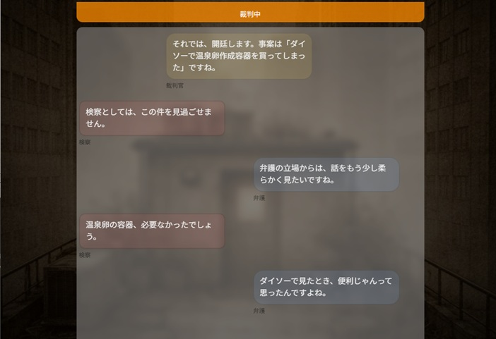

# ⚖️ ゆるゆる裁判所

> 今日あったことを、とりあえず裁いてもらおう。

[](https://yuruyurucourt-rux8dyeb5fqe9acwwsz4f9.streamlit.app/)



---

## 📋 アプリ概要

「コンビニでから揚げ弁当を買った」「阪急電車で座れなかった」――そんな**どうでもいいことを法廷で裁いてしまう**ゆるゆるゲームアプリです。

事案を入力すると、検察・弁護士・裁判官の3キャラクターが応酬を繰り広げ、最終的に判決を下します。お見送りでは弁護士が**事案に合わせたおやつ**を選んで渡してくれます。

**🔗 デモ：https://yuruyurucourt-rux8dyeb5fqe9acwwsz4f9.streamlit.app/**

---

## ✨ 主な機能

| 機能 | 説明 |
|------|------|
| ⚖️ 裁判ゲーム | 事案を入力すると3キャラクターが応酬し、判決を下す |
| ⚔️ 検察・弁護士・裁判官 | 各キャラクターが個性に沿ったAI生成セリフを話す |
| 🎲 レアイベント | 一定確率でキャラクターが「本気」を出す瞬間がある |
| 🍪 おやつRAG | 事案とベクトル的に近いおやつを弁護士が選んで渡してくれる |
| ☀️ 天気・時間帯連動 | 現在の天気・気温・時間帯がキャラクターの会話に滲む |

---

## 🖥️ 画面構成

```
【intro：事案入力】
事案を入力（例：コンビニでから揚げ弁当を買った）
　↓
開廷ボタン

【court：裁判】
4列チャット（検察 / 裁判官 / 弁護士 / あなた）
› ボタンで1件ずつ進む
　↓
なんか言う / 言わない（プレイヤーの発言）
　↓
判決（無罪 / 情状酌量 / 有罪）

【escort：お見送り】
弁護士が判決コメント＋事案に合わせたおやつを渡してくれる
　↓
外に出る

【end：終了】
最初に戻る
```

---

## 🛠️ 技術スタック

| 要素 | 内容 |
|------|------|
| フレームワーク | [Streamlit](https://streamlit.io/) |
| AI | [Groq API](https://groq.com/)（llama-3.3-70b-versatile） |
| ベクトル検索 | [chromadb](https://www.trychroma.com/) + [sentence-transformers](https://www.sbert.net/)（paraphrase-multilingual-MiniLM-L12-v2） |
| 言語 | Python 3.11 |
| デプロイ | Streamlit Community Cloud |
| 外部API | Open-Meteo（天気・気温取得、登録不要・無料） |

---

## 💡 工夫したポイント

### おやつRAG（ベクトル検索）
- 各おやつに「その人はどんな場面でこれを選ぶか」という情景文（`desc`）を持たせ、chromadb にベクトル化して格納
- 事案テキストと意味的に近いおやつ上位3件をランダムに選ぶ
- 弁護士が「なぜそのおやつを選んだか」の理由を`desc`をヒントにAIが生成して話す
- 裁判官の在庫つぶやきにも`desc`を活用し、事案と結びついた独り言が出やすくする

### AIセリフ生成（2段階方式）
- **工程1（テンプレート）**：開廷挨拶・ノイズなど固定セリフは `msg_templates.py` から取得
- **工程2（AI生成）**：応酬・疲れ・レアイベントは Groq API に投げてAI生成
- exchange ターン分を1回のAPIコールで一括生成してキューに積む設計でレスポンスを最適化
- AI失敗時はテンプレートにフォールバック。1裁判あたりの呼び出し上限（30回）も管理

### UI / UX
- セリフはキューに積んで「›」ボタンで1件ずつ表示する「次へ式」採用
- `streamlit-float` で下部ドックを画面固定。チャット領域が常に最下部にスクロール
- 背景画像＋グラデーションオーバーレイでゲームらしい雰囲気を演出
- スマホ（420px以下）でグリッドレイアウトに切り替え

### キャラクター設計
- ⚔️ **検察**：基本否定。押されると弱気。「本件」「看過できません」など裁判らしい言い回し
- 🔵 **弁護士**：基本肯定。熱意にムラがある。犬を飼っている
- ⚖️ **裁判官**：聞いてないようで聞いている。おやつとテレビが気になる

---

## 📁 ファイル構成

```
yuruyuru_court/
│
├── app.py                  # メインアプリ（単一ファイル、約2000行）
├── msg_templates.py        # テンプレートセリフ集
├── snacks.xml              # おやつデータ（desc付きベクトル用）
├── cheap_snacks.xml        # しょぼおやつデータ（レアイベント用）
├── .python-version         # 3.11 を指定（chromadb互換性のため）
├── requirements.txt
├── .streamlit/
│   ├── secrets.toml        # GROQ_API_KEY（GitHub には上げない）
│   └── config.toml
└── assets/
    └── rooftop_bg_ultralight_1600x900.jpg
```

---

## 🚀 ローカルで動かす

```bash
# 1. リポジトリをクローン
git clone https://github.com/yamawaki64-design/yuruyuru_court.git
cd yuruyuru_court

# 2. Python 3.11 の仮想環境を作成
py -3.11 -m venv venv
venv\Scripts\activate  # Windows
# source venv/bin/activate  # Mac/Linux

# 3. 依存パッケージをインストール
pip install -r requirements.txt

# 4. APIキーを設定
#    .streamlit/secrets.toml を作成して以下を記載
#    GROQ_API_KEY = "your_groq_api_key"

# 5. 起動
streamlit run app.py
```

> **Groq API キーの取得**：https://console.groq.com/ から無料で取得できます。

> **Python バージョンについて**：chromadb が Python 3.14 に未対応のため、3.11 を推奨します。

---

## 🔮 今後の検討事項

- [ ] キャラクターの「経験DB」をベクトル化して「そういえば」発言を増やす
- [ ] おやつデータの追加・カスタマイズUI
- [ ] 判決のAI補助（現在はランダム）

---

## 👤 作者

生成AI × RAG実装スキルの掛け合わせを示すポートフォリオとして開発しました。

<!-- TODO: 名前・SNSリンク・Zenn記事URLなどを追記してください -->
<!-- - Zenn: https://zenn.dev/yourname -->
<!-- - Twitter/X: @yourhandle -->
